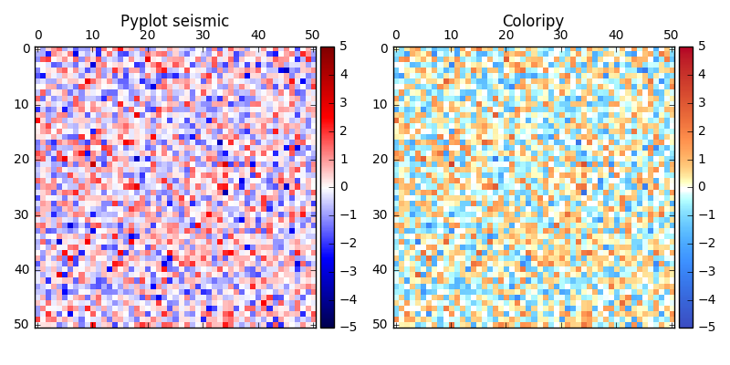

=============================
Coloripy
=============================

.. image:: https://badge.fury.io/py/coloripy.png
    :target: http://badge.fury.io/py/coloripy

.. image:: https://travis-ci.org/ajshajib/coloripy.png?branch=master
    :target: https://travis-ci.org/ajshajib/coloripy

A package to make beautiful diverging color maps in Msh space. For technical details, see "Diverging Color Maps for Scientific Visualization (Expanded)" by Kenneth Moreland (http://www.kennethmoreland.com/color-maps/ColorMapsExpanded.pdf).

Features
--------

* Make aesthetically pleasing diverging color-maps in the Msh space.

Installation
------------

.. code-block:: bash

    $ git clone https://github.com/ajshajib/coloripy.git
    $ cd coloripy
    $ python setup.py install --user

Quick Start
-----------
.. code-block:: python

    import coloripy as cp
    msh_cmap = cp.get_msh_cmap()

Usage Example
-------------
.. code-block:: python

    import numpy as np
    import matplotlib.pyplot as plt
    from mpl_toolkits.axes_grid1 import make_axes_locatable

    import coloripy as cp

    rgb1 = [59, 76, 192] # blue
    rgb2 = [180, 4, 38] # red
    ref_point = [221, 221, 221] # mid-point

    msh_cmap = cp.get_msh_cmap(rgb1, rgb2,
                               ref_point=ref_point,
                               rescale='power',
                               power=2.5,
                               num_bins=101)

    mat = np.random.normal(size=(51, 51))

    fig, (ax1, ax2) = plt.subplots(ncols=2, figsize=(8, 4))

    img1 = ax1.matshow(mat, vmax=5, vmin=-5, cmap='seismic')
    ax1.set_title('Pyplot seismic')
    divider = make_axes_locatable(ax1)
    cax1 = divider.append_axes("right", size="5%", pad=0.05)
    fig.colorbar(img1, cax=cax1)

    img2 = ax2.matshow(mat, vmax=5, vmin=-5, cmap=msh_cmap)
    ax2.set_title('Coloripy')
    divider = make_axes_locatable(ax2)
    cax2 = divider.append_axes("right", size="5%", pad=0.05)
    fig.colorbar(img2, cax=cax2)

    plt.tight_layout()
    plt.show()

